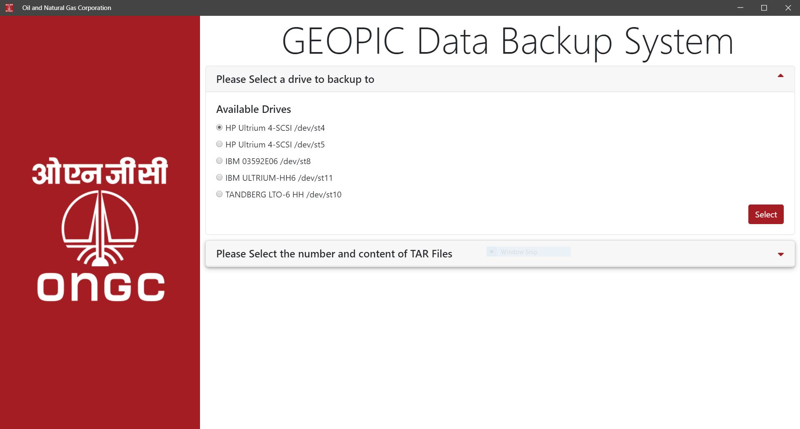
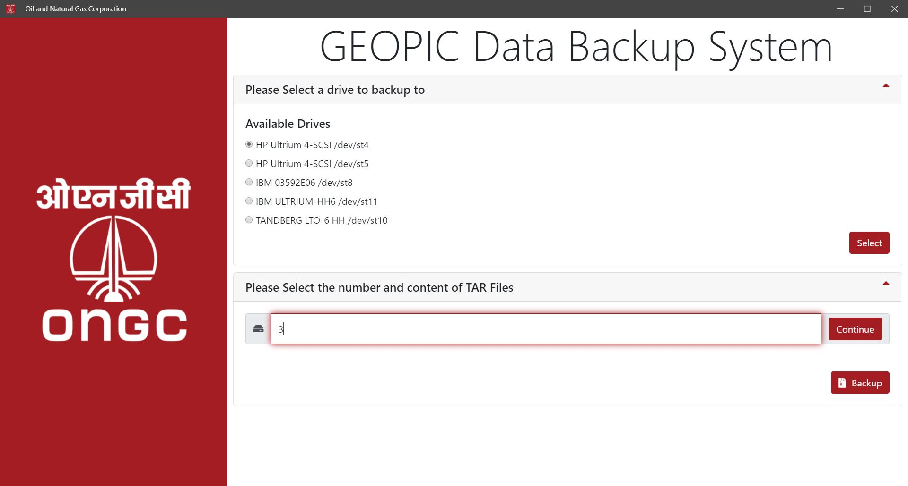
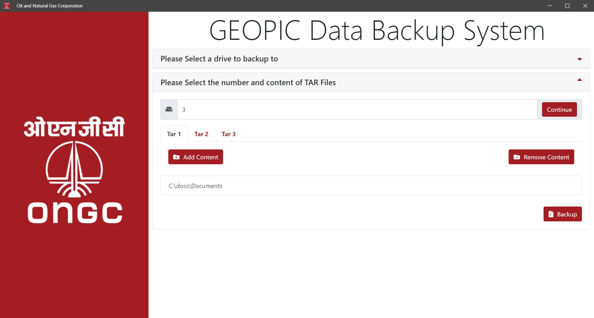

# ONGC-Data-Backup-System

## Description

As an intern at the Geodata Processing and Interpretation Centre,ONGC I was responsible for simplifying the workflow of backing up files on magnetic drives attached to systems running Red Hat Enterprise Linux. Built a desktop application using **ElectronJS, jQuery, Bootstrap, Font Awesome** making an **intuitive, easy to use GUI** to simplify backing up files thus saving time for the organisation and the tedious task of running commands again and again.

